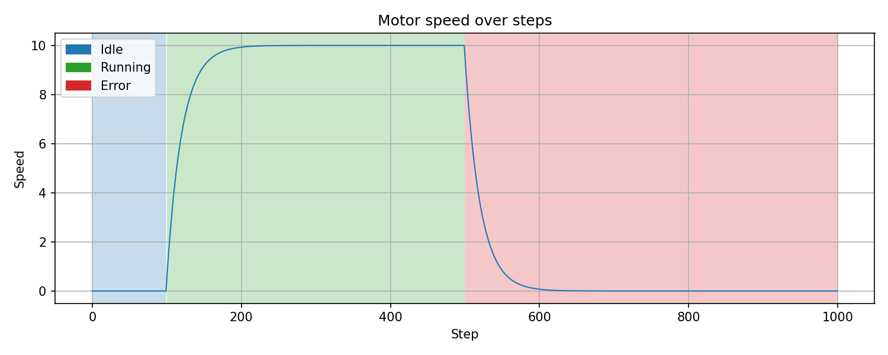

# demofsm



`demofsm` is a simple demonstration of a finite state machine (FSM) implemented in C++ with an example Python helper script for plotting logs. It provides a minimal working example to understand how an FSM can be structured in C++, and how logging/visualization can be handled with Python.

This project contains:

- A C++ implementation of a finite state machine (`fsm.cpp`). :contentReference[oaicite:0]{index=0}
- A Python script to visualize logs (`plot_log.py`). :contentReference[oaicite:1]{index=1}
- Build configuration files (CMakeLists, Makefile, Dockerfile). :contentReference[oaicite:2]{index=2}
- A state machine diagram (`fsm.png`). :contentReference[oaicite:3]{index=3}

---

## 📁 Repository Structure

```
.
├── CMakeLists.txt
├── Dockerfile
├── Makefile
├── fsm.cpp
├── fsm.png
├── plot_log.py
├── .gitignore
└── LICENSE
```

## 🧠 Overview

The finite state machine implemented here is meant for educational/demo use. The included image (`fsm.png`) shows the design of the machine states and transitions.

If you’re exploring how to structure an FSM in C++, this repository gives a minimal starting point.

## 🛠️ Build & Run (C++)

### Using CMake

```bash
mkdir build
cd build
cmake ..
make
./demofsm   # or the generated executable
```


### Using Makefile

```bash
make
./demofsm
```

You can also build inside the provided Dockerfile for a consistent environment.

### Plotting Logs (Python)

If the FSM implementation generates a log file you want to visualize, you can use the plot_log.py script.

Make sure you have matplotlib installed:

```bash
pip install matplotlib
```

Then run:

```bash
python plot_log.py <path_to_log_file>
```

Replace <path_to_log_file> with your actual log file location.